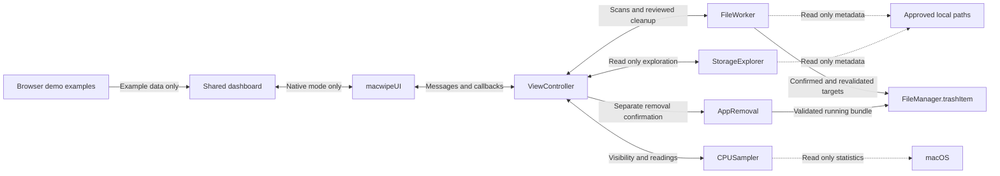

# Engineering overview

This document describes the native application and its shared browser interface.
[README.md](README.md) contains setup and release commands. The Python CLI is a
separate implementation and is not part of the native dashboard request path.

## Architecture

| Component | Implementation | Responsibility |
| --- | --- | --- |
| Native entry point | `native/main.swift` | Creates the AppKit application and its resizable 900 by 600 window. |
| Native host | `ViewController` in `native/ViewController.swift` | Loads bundled dashboard resources into WKWebView, validates bridge messages, and schedules filesystem work. |
| Shared dashboard | `website/dashboard.html`, `website/styles/dashboard.css`, `website/scripts/dashboard.js` | Renders Home, category rows, exploration, selection, sorting, Details, and review dialogs. |
| JavaScript bridge | `macwipeUI` in `website/macwipe-bridge.js`, mirrored in `native/Web/macwipe-bridge.js` | Sends structured action payloads, tracks pending operations and request IDs, and delivers native results to the dashboard. |
| Filesystem scanner | `FileWorker` in `native/ViewController.swift` | Measures category candidates, stores approved snapshots, manages Keep exclusions, and revalidates cleanup targets. |
| Storage explorer | `StorageExplorer` in `native/ViewController.swift` | Measures approved local roots and folder contents without registering cleanup targets. |
| Metrics | `CPUSampler`, `CPUCalculation`, and `MetricStates` in `native/ViewController.swift` | Samples CPU activity and publishes memory pressure and thermal state. |
| Application removal | `AppRemoval` in `native/ViewController.swift` | Validates and removes only the running application through a separate confirmation. |
| Browser examples | `website/scripts/demo-data.js` and demo branches in `dashboard.js` | Supply fictional storage, file, and explorer data; simulate actions locally. |
| Local chat | `website/scripts/ui.js` | Creates shared dialog chat markup and records typed messages in memory without a remote service. |

WKWebView is Apple's embedded browser view. The host uses a nonpersistent
website data store and restricts navigation and native messages to the bundled
main dashboard page. Messages from another page or frame cannot invoke the
native operations. Replies are JSON values delivered to JavaScript callbacks.

## System diagram

Dotted edges represent measurements. Cleanup reaches `FileManager.trashItem`
only after confirmation and native checks. In a regular browser, the dashboard
uses its demo branches instead of sending filesystem actions to the native
host. Shared markup does not give the demo access to local files.

## Main flows

### Startup and category scanning

1. `main.swift` creates the window and `ViewController`. The controller loads
   `Web/dashboard.html` from the app resources and injects the bridge.
2. `dashboard.js` detects the WKWebView message handler, installs callbacks,
   opens Home, and sends `requestScan`. In a regular browser it initializes
   example data instead.
3. The native default scope is Downloads and Caches. `ViewController` sends
   work to its serial `macwipe.files` queue. `FileWorker` validates category
   roots and measures entries while counting actual traversal progress.
4. Results include measured inventory bytes, eligible bytes, item metadata,
   timestamps, skipped paths, and macOS volume capacity. Opening another
   unscanned category requests that category alone. Previously completed
   category results remain in memory until refreshed.

Home keeps capacity separate from file inventories. Its review cards use
explicit recommendation flags and known positive sizes, excluding kept and
unmatched support items. Empty categories retain navigation cards. Neither
kind of card selects files.

### Storage exploration

1. Explore storage opens an initially unscanned native view. Scan storage sends
   `requestExplorer` without an item ID.
2. `StorageExplorer` considers Downloads, Documents, Desktop, Movies, Music,
   Pictures, and Applications under the user home, plus `/Applications`.
   Valid roots must be local and on the same filesystem device as the home.
3. It reads metadata rather than file contents. Descendant symlinks are not
   followed. Cloud items that are not locally current are skipped without
   requesting downloads. Recognized packages, such as app bundles, appear as
   one item and cannot be opened as explorer folders.
4. Folder navigation sends an inventory ID, not an arbitrary path. The native
   engine checks that ID, its saved metadata, and its approved root before
   measuring immediate children and their contents. Breadcrumbs allow return
   to previously registered ancestors.
5. Explorer rows are read only. They support size sorting, Details, and Finder
   reveal, but never enter `FileWorker` cleanup approvals.

### Selection, review, and cleanup

1. The dashboard stores selected item IDs independently from rendered rows.
   Size sorting preserves that selection. Bulk selection uses only items
   explicitly classified as temporary and allowed for bulk selection.
2. Review removes duplicate paths and selections already covered by a parent
   folder. It shows item names, logical size, and relevant consequences.
   Shared hard linked file bytes count once while individual rows retain
   their logical sizes.
3. Confirming Move to Trash sends category IDs and explicit selected paths.
   JavaScript checks these against its scan result. `FileWorker` independently
   requires a native approval; a frontend flag alone cannot authorize removal.
4. Each selected category's approvals are consumed for that attempt. Before
   moving a target, native code verifies the approved root, resolved path,
   running app exclusion, Keep rules, and a fresh recursive metadata snapshot.
   Snapshots include device, inode, file type, size, link count, and modification
   and change timestamps. An inode is the filesystem identifier for a file.
5. The Downloads modification rule is checked again. Files that changed or
   became unreadable are rejected. Overlapping targets move the parent once.
   The sole native cleanup mutation is `FileManager.trashItem`; there is no
   fallback to permanent deletion.
6. Results report moved paths, count, and logical bytes separately from failed
   paths and messages. The host refreshes the selected category scopes and
   capacity. It does not claim that the moved byte count equals freed space.

### Cancellation and stale results

User scan and explorer requests carry increasing request IDs. The bridge
ignores callbacks whose explicit ID does not match the active request.
`ViewController` also tracks a page generation so work from an earlier page
load cannot update a replacement dashboard. Pending operations block duplicate
work; cancellation and metric visibility messages are handled separately.

`ScanControl` exposes a cancellation flag checked during traversal. Category
cancellation retains completed results and timestamps, removes approvals for
the cancelled scopes, and leaves unrelated approvals intact. The UI disables
cleanup in cancelled categories until a fresh scan. Explorer cancellation
restores its previous inventory and navigation state. Cancellation stops scans,
not a Trash operation already underway.

Automatic cleanup rescans use native request ID `0`, omitted from the returned
scan payload. This is distinct from user request IDs and is accepted by the
bridge's cleanup refresh path.

## Safety decisions

| Decision | Confirmed behavior |
| --- | --- |
| Downloads age | A selectable item must be a regular file directly inside Downloads with a modification timestamp strictly earlier than the current time minus 30 days. Folders, symlinks, and files exactly at the boundary do not qualify. This says nothing about last use. |
| Recognized caches | Only `~/Library/Caches/pip/http-v2` and `~/Library/Caches/pip/wheels` match the native recognition table. Their location allows temporary classification, bulk selection, and Home recommendations when otherwise eligible. |
| Unknown caches | Unrecognized candidates can be selected individually after review. Their removal consequences are not established. A cache name or missing classification does not grant bulk eligibility. |
| Unmatched support | App names, bundle identifiers, and vendor components are compared with support folder names. A missing match does not prove data is unused. These folders remain individual review candidates and are excluded from Home recommendations. |
| Startup and system logs | `startup` and `performance` produce read only rows and are explicitly rejected by native cleanup. `performance` is labeled Logs in the sidebar and includes system logs and user diagnostic reports. The separate internal `logs` category covers user logs and can have approved cleanup items; it is not the sidebar Logs view. |
| Keep exclusions | Normalized paths persist in `UserDefaults` under `macwipe.keptPaths`. A kept folder protects descendants, and a kept descendant blocks removal of its containing folder. The native cleanup check applies even to an earlier approval. |
| Reversing Keep | Allow recommendations again removes related encompassing and descendant exclusions for that path. The Details explanation describes this effect. Browser demo exclusions use `macwipe.demo.keptIDs` in local storage when available. |
| Removing MacWipe | `removeApplication` is separate from category cleanup. `AppRemoval` checks the running bundle's identity, executable, path, and writable location, then moves that bundle to Trash and quits only on success. It does not remove support data or other installed copies. |

The native app does not kill processes, empty Trash, or automatically clean
files. Its suggestion to close affected apps is advice rather than a native
process detection or enforcement mechanism. Browser data scanning uses named
trace targets rather than treating an entire browser profile as disposable.

## Efficiency and resource use

| Technique | Implementation and limits |
| --- | --- |
| Background filesystem work | A serial queue keeps category measurements, exploration, and cleanup away from the AppKit main thread. UI replies return to the main thread. |
| Scoped scans | Startup scans Downloads and Caches. Category requests refresh specified scopes; other completed results and timestamps are retained in memory. There is no persistent file index or filesystem watcher. |
| Explorer budget | Each scan or folder request shares a limit of 100,000 processed entries and a 10 second traversal budget across recursive measurements. Time uses monotonic system uptime, which is elapsed time unaffected by clock adjustments. |
| Budget exhaustion | Measured results remain Partial with the message “Scan limit reached. Explore a smaller folder.” Unvisited roots have no size and say Not scanned. Limits are distinct from user cancellation. Blocking filesystem calls can overrun the budget before returning. |
| Bounded display | Folder requests retain the largest 50 immediate children. Aggregation still includes measured children omitted from that display. The display cap alone does not limit traversal; the shared budget does. |
| Identity accounting | `LogicalSizeTotal` counts regular files once by device and inode in folder, category, storage, explorer, and successful cleanup aggregates. Shared identity metadata also supports dashboard review totals. Distinct APFS clones retain distinct identities. |
| Dashboard rendering | Cached item rows and delegated event handlers preserve selection without rebuilding rows for each checkbox change. Sorting remembers a separate order for each category and places unknown sizes last within review groups. |
| CPU sampling | One timer samples aggregate Mach CPU tick counters every 3 seconds with 0.4 seconds of tolerance. The first sample establishes a baseline; a later sample computes activity from elapsed ticks. |
| Metric lifecycle | Sampling runs only for visible Home in an active app with a visible, unminimized, unoccluded window. Stopping invalidates the timer and observers; resuming creates a fresh CPU baseline. Memory pressure uses Dispatch events, and thermal state uses `ProcessInfo` and notifications. |

The explorer budget does not bound the separate `FileWorker` category scans or
their recursive cleanup revalidation. No performance benchmark is claimed.

## Problems addressed

| Problem | Implemented solution |
| --- | --- |
| Misleading storage totals | Home reads total and available capacity from macOS. File inventories are labeled separately; candidate sizes are not subtracted to manufacture available space or an Other category. |
| Duplicate measurements | Native totals use file identity rather than blindly summing rows. Nested explorer roots are consolidated, and review removes duplicate or descendant targets before counting them. |
| Stale scan callbacks | Request IDs filter superseded replies and progress. Page generations protect dashboard reloads; cancellation retains completed data instead of replacing it with unfinished results. |
| Uncertain cleanup candidates | Native metadata distinguishes recognized caches, unknown candidates, and unmatched support. Bulk and recommendation flags require an explicit classification rather than a folder name. |
| Crowded Home | Shared CSS keeps a 130 pixel ring beside disk figures, two compact cards, a system row, and a footer. The ring center shows the available amount and its label. Longer storage, system, and skipped path explanations open dialogs. |
| Diverging native and demo UI | Both load `dashboard.html` and its shared scripts and styles. Native mode consumes Swift results, while demo branches use examples and simulated actions. The build checks that the two bridge source files match. |

## Limits and tradeoffs

Logical sizes represent file content lengths. They differ from allocated disk
space because of compression, sparse files, filesystem metadata, and shared
storage. Deduplicating hard links does not measure APFS clone sharing or
predict what deletion would reclaim. Explorer coverage does not include every
system managed file, snapshot, or storage allocation. Available capacity stays
a separate macOS measurement.

Permissions can prevent traversal, reveal, or removal. A partly unreadable
folder is not approved as a whole; accessible children can still be measured
and reviewed, while unreadable app bundles are skipped. A partial total covers
only what was measured. Zero, unavailable, and unscanned states are distinct.
The app does not elevate permissions or grant itself Full Disk Access.

CPU readings require valid successive samples. Stale CPU readings older than
6.5 seconds are masked when combined metrics are published. Memory pressure
starts Unavailable and needs a macOS event; it is not inferred from free RAM.
Thermal readings can also be unavailable. These indicators describe current
system activity, not a measured benefit from cleanup. Removing files does not
guarantee a faster computer, and caches may be recreated.

The current build and packaging scripts use an ad hoc signature. It verifies
bundle integrity but does not establish a Developer ID distribution identity.
They do not request notarization or staple a notarization ticket. Apple
notarization has not been verified for the distributed ZIP. macOS launch
restrictions and filesystem permissions still apply.

## Repository guide

| Path | Purpose |
| --- | --- |
| `native/main.swift` | AppKit entry point and window configuration. |
| `native/ViewController.swift` | Host, bridge dispatch, filesystem engines, identity accounting, metrics, and app removal. |
| `native/Web/macwipe-bridge.js` | Native copy of the JavaScript adapter. Keep it identical to the website copy. |
| `native/Info.plist`, `native/macwipe.entitlements` | Bundle identity, macOS 13 minimum, access descriptions, and signing entitlements. |
| `native/Assets/` | Application icon and launch image assets. |
| `native/build.sh`, `native/package.sh` | Compile, assemble, sign, and package current sources. |
| `native/build/`, `native/release/` | Generated app bundles and release staging, ignored by Git. |
| `website/index.html`, `website/scripts/landing.js` | Static landing page and local FAQ dialogs. |
| `website/dashboard.html`, `website/scripts/dashboard.js` | Shared dashboard structure, rendering, and user interaction. |
| `website/macwipe-bridge.js` | Native message adapter and callback validation. |
| `website/scripts/demo-data.js`, `website/scripts/ui.js` | Fictional examples and shared local chat widgets. |
| `website/styles/`, `website/assets/` | Shared styling, icons, and images. |
| `website/downloads/macwipe-macos.zip`, `website/vercel.json` | Tracked native download and static hosting configuration. |
| `mac_scrubber/` | Independent Python CLI and helper scaffold with different cleanup policies. |
| `tests/native-tests.py`, `tests/native-scanner.swift` | Compile and exercise Swift using temporary fixtures and mocked mutation functions. |
| `tests/native-dashboard.cjs`, `tests/web-demo.cjs` | Browser checks for mocked native communication and the example demo. |
| `tests/test_safety.py`, `tests/test_runtime.py` | Python manager checks. |
| `.github/workflows/tests.yml` | Python unit test workflow on macOS; it does not validate the Swift app. |
| `docs/screenshots/` | Saved browser previews that may predate the current dashboard. |

The native bundle copies current website resources but excludes website
downloads and hosting state. Publishing the static website does not publish
Swift or Python source into the browser application. Native packaging updates
the existing website ZIP without requiring a landing page URL change.
