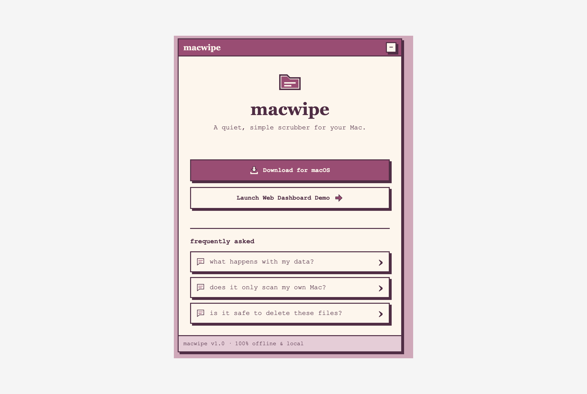
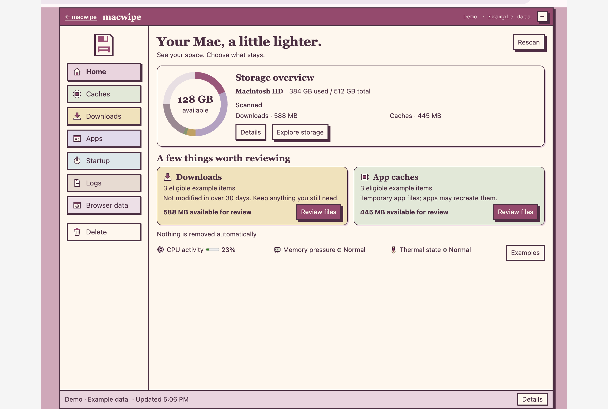
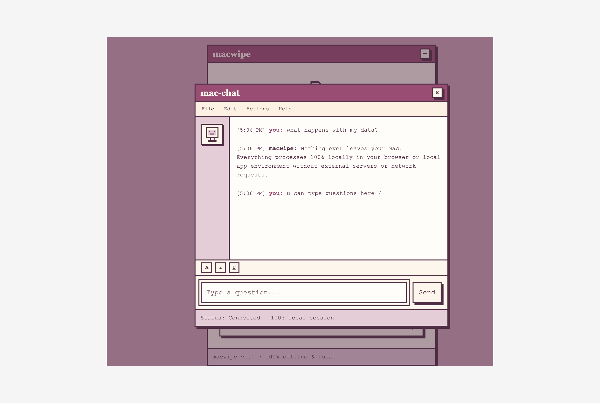
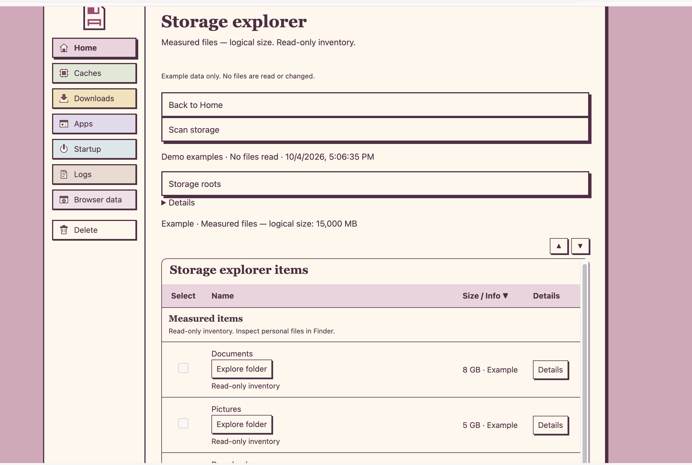

# MacWipe

MacWipe helps Mac users inspect local storage and review files before moving
selected items to Trash. It provides a native macOS application and a browser
demo that uses the same dashboard with example data.

Website and demo: https://macwipe.vercel.app

Native download: https://macwipe.vercel.app/downloads/macwipe-macos.zip

## Current features

Home shows disk capacity reported by macOS, scanned Downloads and Caches
summaries, and CPU activity, memory pressure, and thermal state. Recommendations
open a review category without selecting files. When nothing qualifies, Home
keeps navigation cards for reviewing Downloads and caches.

Storage exploration measures files in approved local folders. It supports
folder navigation and size sorting without granting cleanup permission.
Category lists sort by size within their review groups. Details show paths,
exact byte values, and removal consequences. Keep exclusions persist in the
native app and prevent selection and cleanup until reversed.

| Category | Native behavior |
| --- | --- |
| Caches | Review app caches. Bulk selection covers only recognized pip cache directories. |
| Downloads | Select regular files directly inside Downloads that were not modified in over 30 days. |
| Apps | Review installed apps and support folders with no matching installed app identified. |
| Startup | Inspect launch configuration files without changing them. |
| Logs | Inspect system logs and diagnostic reports without changing them. |
| Browser data | Review supported Safari and Chrome history, cookies, and storage traces. |

## Native app and browser demo

| Capability | Native app | Browser demo |
| --- | --- | --- |
| Storage and category data | Actual accessible local files and macOS capacity | Fictional examples |
| System indicators | macOS readings while Home is visible and the app is active | Stable example values |
| Cleanup | Confirmed selections move to Trash after native validation | Simulation clears selections without changing files |
| Keep exclusions | Saved through macOS preferences | Saved in browser local storage when available |
| Finder and system settings | Validated Finder reveals and fixed system destinations | Simulated actions |

The demo cannot scan your Mac or delete files. Its chat accepts local text and
keeps messages in memory without a server request. Closing the page discards
that chat history. The static website needs no build step, account, or runtime
package installation.

## Cleanup safeguards

Nothing is removed automatically. Review selected items and confirm Move to
Trash before native cleanup. The native manager accepts only approved scan
paths and rechecks file identity, metadata, location, and Keep exclusions
immediately before moving each target. Changed or inaccessible targets fail
with a reported error. Startup, the Logs view, and storage exploration are
read only. Trash is never emptied.

Recognized caches are candidates with known locations, not guaranteed safe
removal. Unknown caches and unmatched support folders require individual
review and do not enter bulk selection or Home recommendations. Support
folders may contain settings or personal data. Close affected applications
and browsers before confirming removal. Removing an app does not run its
vendor uninstaller or remove all supporting data.

Delete macwipe is a separate confirmation that targets only the running app
bundle. It quits after a successful move to Trash. Normal cleanup excludes
that bundle and directories that would include it.

## Screenshots

<table>
  <tr>
    <td><a href="docs/screenshots/macwipe-landing.png"></a><br>Landing page</td>
    <td><a href="docs/screenshots/macwipe-home-demo.png"></a><br>Home dashboard (demo)</td>
  </tr>
  <tr>
    <td><a href="docs/screenshots/macwipe-chat.png"></a><br>Chat window</td>
    <td><a href="docs/screenshots/macwipe-storage-explorer-demo.png"></a><br>Storage explorer (demo)</td>
  </tr>
</table>

Click a screenshot to view the larger image.

## Local website and native builds

Clone the repository and open the website on macOS:

```sh
git clone https://github.com/julsoyola/macwipe.git mac-scrubber
cd mac-scrubber
open website/index.html
```

From an existing repository root, open the dashboard directly:

```sh
open website/dashboard.html
```

The native app supports macOS 13 or newer on Apple silicon and Intel Macs.
Building requires macOS, Xcode command line tools with a Swift compiler and
macOS SDK, and the system utilities used by the scripts. It needs no Node or
Python runtime. Install the tools if needed:

```sh
xcode-select --install
```

From the repository root:

```sh
./native/build.sh --launch
```

This builds for the current Mac architecture and opens
`native/build/macwipe.app`. Launching starts a Downloads and Caches scan.
Other categories scan when first opened. To build both supported architectures
without launching:

```sh
./native/build.sh --universal
```

## Download and release

Download the existing ZIP, extract it, and open `macwipe.app`. The current
release uses an ad hoc code signature, not a Developer ID distribution
signature. Apple notarization has not been verified. macOS may restrict
launching a downloaded build.

To regenerate the download from current sources:

```sh
./native/package.sh
```

The script builds both `arm64` and `x86_64`, copies the current dashboard and
bridge into the app, and checks the signature and architectures before and
after extracting the ZIP. It writes `native/release/macwipe-macos.zip` and
copies it to `website/downloads/macwipe-macos.zip`. The latter is tracked and
is the landing page download target. Generated app bundles and native release
staging are ignored by Git. Packaging does not launch the app or run cleanup.

The website is a static Vercel project defined in `website/vercel.json`.
Publish the `website/` directory, including its download ZIP. No website build
step is required.

## Known limitations

File totals use logical sizes, meaning file content lengths rather than
physical disk allocations. They are not a promise of reclaimable space.
Moving files to Trash does not reclaim their space. Available capacity comes
from macOS rather than subtracting cleanup estimates.

Permissions, cloud placeholders, and scan limits can leave incomplete results.
Explorer requests share a 100,000 entry limit and a 10 second traversal budget;
a blocking filesystem call can exceed that time before returning. Partial
results and skipped locations remain visible. Missing system readings are
Unavailable. Memory pressure can remain unavailable until macOS sends an
event. Cache files can be recreated. Cleanup does not guarantee better
computer performance.

## Separate Python manager

`mac_scrubber/` is an independent macOS CLI requiring Python 3.9 or newer and
only the standard library. Use a supported `python3` installation from the
repository root:

```sh
python3 -m mac_scrubber --help
python3 -m mac_scrubber scan --section Caches --json
python3 -m mac_scrubber interactive --dry-run
```

Scanning is read only. Actions require explicit candidate IDs and interactive
confirmation. Its Downloads policy differs from the native modification rule.
Its Homebrew cleanup can permanently remove old versions and downloads.
These behaviors do not describe the Swift dashboard. The Python loopback
helper lacks its `mac_scrubber/ui/` assets and is not the dashboard backend.

## Development and tests

Read [INfo.md](INfo.md) for architecture, flows, and repository responsibilities.
[CONTRIBUTING.md](CONTRIBUTING.md) covers contribution practices. Use temporary
fixtures and mocked cleanup operations rather than personal files.

Available checks from the repository root:

```sh
python3 -m unittest discover -s tests -v
python3 tests/native-tests.py
./native/build.sh
python3 tests/native-tests.py --ui
git diff --check
```

The native fixture runner compiles and executes Swift on macOS. The optional
`--ui` check uses the built resources in WKWebView with fixture scan roots and
a stub Trash operation. The configured GitHub workflow runs Python unit tests;
it does not build or verify the Swift app.

Browser checks require Playwright and Google Chrome. Existing setup commands
keep test tooling outside the repository; the website itself does not need it:

```sh
MACWIPE_TEST_TOOLS="$(mktemp -d /tmp/macwipe-test-tools.XXXXXX)"
npm install --prefix "$MACWIPE_TEST_TOOLS" playwright
NODE_PATH="$MACWIPE_TEST_TOOLS/node_modules" node tests/web-demo.cjs
NODE_PATH="$MACWIPE_TEST_TOOLS/node_modules" node tests/native-dashboard.cjs
```

The checks expect Chrome at
`/Applications/Google Chrome.app/Contents/MacOS/Google Chrome`. The native
browser check mocks bridge calls; it does not execute Swift filesystem actions.

MIT license.
