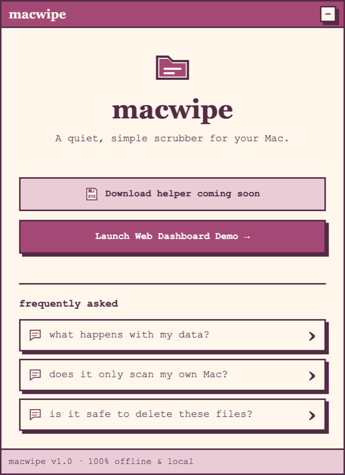
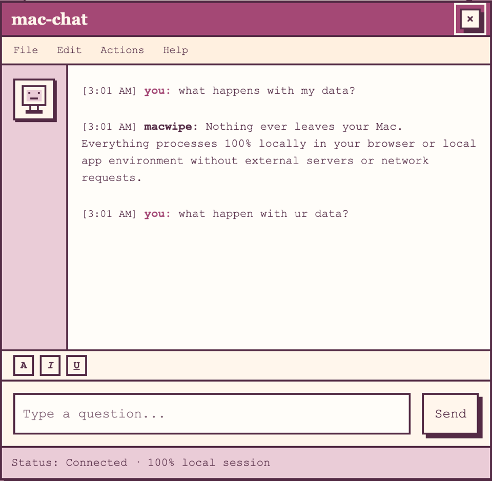
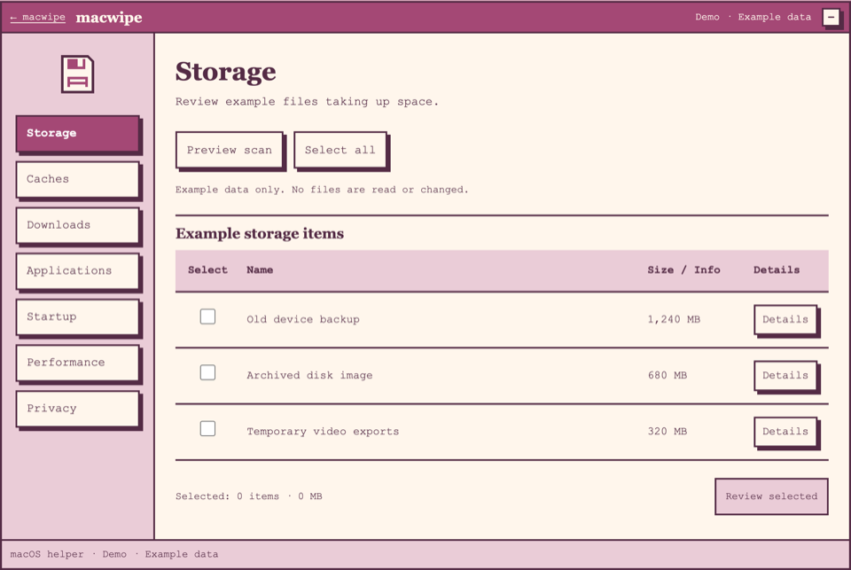
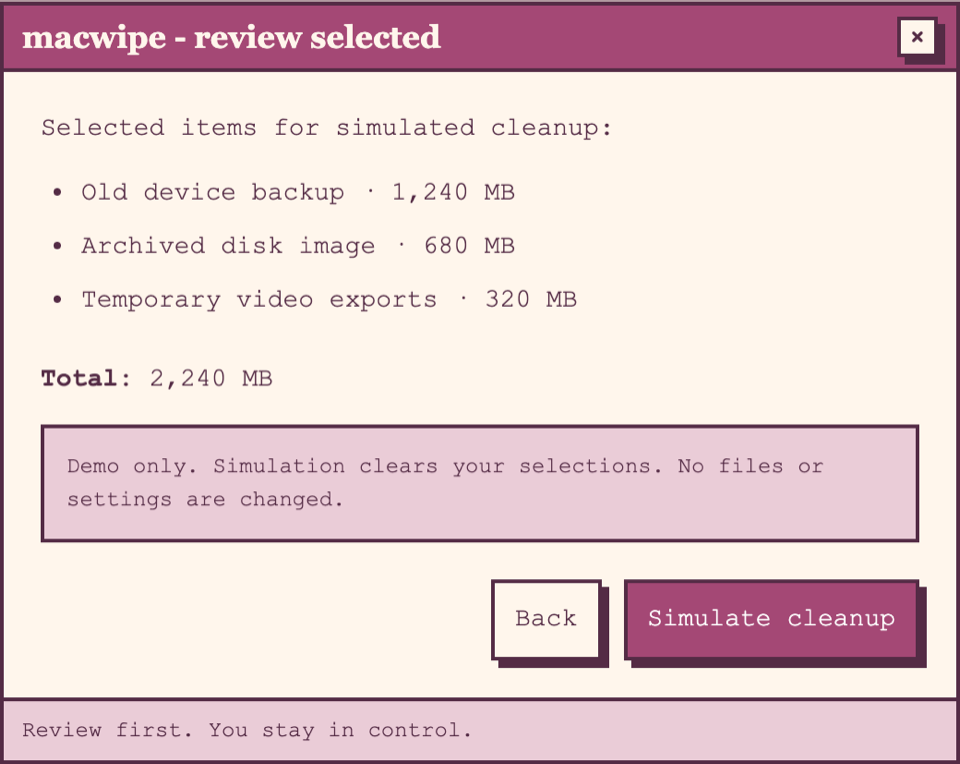

# macwipe

A quiet, retro Mac cleanup dashboard demo. Built with HTML, CSS, and vanilla
JavaScript. No install, build step, account, or runtime dependencies.

**Example data only:** the demo cannot scan your Mac or delete files.
Simulate cleanup clears selections. Chat messages stay in browser memory;
there are no server requests, analytics, or saved chat history.
The native helper download is not available yet.

## Preview

<table>
  <tr>
    <td><a href="docs/screenshots/landing.png"></a><br></td>
    <td><a href="docs/screenshots/chat.png"></a><br></td>
  </tr>
  <tr>
    <td><a href="docs/screenshots/dashboard.png"></a><br></td>
    <td><a href="docs/screenshots/review.png"></a><br></td>
  </tr>
</table>

Click a preview to view the larger image.

## Download and run locally

Requires a recent browser. On macOS:

```sh
git clone https://github.com/julsoyola/macwipe.git
cd macwipe
open website/index.html
```

Or use GitHub's **Code → Download ZIP**, unzip it, and open
`website/index.html`. This repository is private, so sign in with an account
that has access. For HTTPS cloning, use your GitHub credential manager or
`gh auth login`; GitHub account passwords do not authenticate Git operations.
After downloading, the demo works offline.

## Try the demo

1. Click **Launch Web Dashboard Demo**.
2. Choose a category and click **Preview scan** or **Details**.
3. Select individual items or **Select all**.
4. Click **Review selected → Simulate cleanup** to reset selections.
5. On the landing page, open an FAQ and send a local message using Send or Enter.

## Files

- `website/index.html` and `website/dashboard.html`: the two pages.
- `website/styles/`: shared theme and dashboard layout.
- `website/scripts/`: shared UI, example data, and page behavior.
- `website/assets/`: local SVG icons.
- `docs/screenshots/`: small README previews.

MIT license. Only the web demo is included; no native cleanup tools are shipped.
